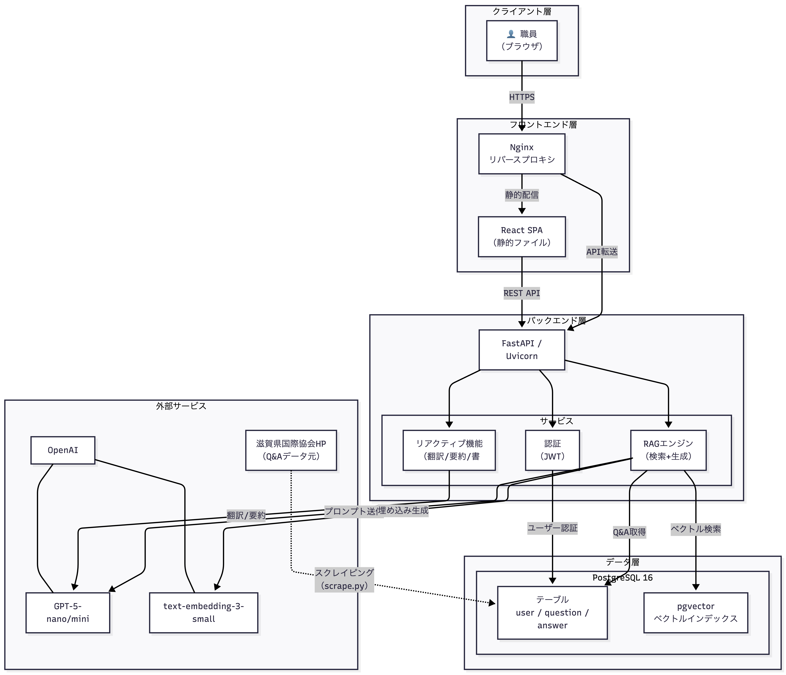

# 要件定義書
参考（ https://qiita.com/syantien/items/9a8a7cbaeca2be3ef0d7 ）

## 1. システム概要

滋賀県国際協会職員向けの多言語対応Q&Aチャットサービス「ShigaChat」。公式HP「生活相談Q&A」のデータをベースに、RAG（検索拡張生成）技術を用いて職員の相談対応業務を支援する。

### A) システム構成図



#### 構成要素一覧

| 層 | コンポーネント | 技術/ツール | 役割 |
|----|----------------|-------------|------|
| クライアント | ブラウザ | Chrome/Firefox/Safari/Edge | ユーザーインターフェース |
| フロントエンド | Nginx | Nginx | リバースプロキシ、静的ファイル配信 |
| フロントエンド | React SPA | React 18, Tailwind CSS | UI表示、ユーザー操作 |
| バックエンド | API Server | FastAPI, Uvicorn | REST API、ビジネスロジック |
| バックエンド | RAGエンジン | pgvector, OpenAI | ベクトル検索、回答生成 |
| バックエンド | 認証 | JWT, bcrypt | ユーザー認証・認可 |
| データ | PostgreSQL | PostgreSQL 16 | Q&A、ユーザー、履歴等の永続化 |
| データ | pgvector | pgvector拡張 | ベクトル類似検索 |
| 外部 | OpenAI API | GPT-5, Embedding | LLM回答生成、ベクトル埋め込み |
| 外部 | 滋賀県国際協会HP | スクレイピング | Q&Aデータソース |

### B) 背景

- 職員が相談対応中に素早く根拠情報を参照できる仕組みが必要
- ソース情報となる生活相談Q&Aの言語との対応を取るため、多言語対応が必須
- 利用状況の統計収集および将来的な機能拡張のため、ユーザー認証を導入

### C) 定義

| 用語 | 定義 |
|------|------|
| ShigaChat | 本システムの名称 |
| RAG | Retrieval-Augmented Generation。ベクトル検索で関連Q&Aを取得し、それを文脈としてLLMで回答を生成する方式 |
| pgvector | PostgreSQLのベクトル検索拡張 |
| リアクティブ機能 | 翻訳・要約・書き換えなど、直接的なテキスト操作タスク |
| スレッド | 一連の会話履歴をまとめた単位 |

---

## 2. 業務要件

### A) 業務フロー

```
1. 職員が外国人相談を受ける（対面/電話/メール等）
        ↓
2. 職員がShigaChatに質問を入力
        ↓
3. システムが回答案を提示
   ├─ RAGチャット：自然文回答 + 参照Q&A
   ├─ キーワード検索：該当Q&A一覧
   └─ カテゴリ検索：分類別Q&A一覧
        ↓
4. 職員が内容を確認し、相談者へ回答
        ↓
5. 必要に応じて翻訳機能で多言語化
```

### B) 規模

| 項目 | 規模 |
|------|------|
| 利用者 | 滋賀県国際協会職員（数名〜数十名） |
| 同時アクセス | 小〜中規模（〜10程度） |
| Q&Aデータ | 約300件 × 9言語 = 約2,700件 |
| カテゴリ数 | 13カテゴリ |
| 対応言語 | 日本語、英語、ベトナム語、中国語、韓国語、ポルトガル語、スペイン語、タガログ語、インドネシア語 |

### C) 時期・時間

| 項目 | 内容 |
|------|------|
| 利用時間帯 | 業務時間中（平日日中が主） |
| データ更新 | 手動（スクレイピングスクリプト実行） |
| 障害対応 | 業務時間帯優先（未定） |

### D) 指標

| 指標 | 目標値 |
|------|--------|
| RAGチャット応答時間 | 1〜15秒以内 |
| キーワード/カテゴリ検索応答時間 | 3秒以内 |
| システム稼働率 | 業務時間中95%以上(未定) |

### E) 範囲

| 範囲内 | 範囲外 |
|--------|--------|
| 職員向けWeb UI | 一般公開（相談者向け）機能 |
| Q&A検索・チャット | 外部自動送信（メール返信等） |
| 多言語翻訳 | SSO/外部ID連携 |
| 通知・スレッド管理 | モバイルアプリ |

---

## 3. 機能要件

### A) 機能

| No | 機能名 | 概要 |
|----|--------|------|
| F01 | ユーザー登録 | 名前・パスワード・使用言語を登録 |
| F02 | ログイン/ログアウト | JWT認証によるセッション管理 |
| F03 | RAGチャット | 自然文質問→ベクトル検索→LLM回答生成 |
| F04 | キーワード検索 | 部分一致によるQ&A検索 |
| F05 | カテゴリ検索 | カテゴリ別Q&A一覧表示 |
| F06 | 翻訳 | 対応言語間の相互翻訳 |
| F07 | 要約 | 長文の要点抽出 |
| F08 | 書き換え | 文章の校正・整形 |
| F09 | スレッド管理 | 会話履歴の保存・切り替え |
| F10 | 通知 | 新規Q&A登録の通知（スクレイピング時） |
| F11 | 言語設定 | ユーザーの使用言語変更 |

### B) 画面

| 画面No | 画面名 | ファイル | 概要 |
|--------|--------|----------|------|
| S00 | 共通レイアウト | NavBar.js | ヘッダー、サイドバー（ログイン後の全画面共通） |
| S01 | ログイン | New.js | ユーザー名/パスワード入力、言語選択 |
| S02 | 新規登録 | Shinki.js | ユーザー登録フォーム |
| S03 | ホーム/チャット | home.js | メイン画面。ChatGPTライクなUI |
| S04 | キーワード検索 | keyword.js | キーワード入力、結果一覧表示 |
| S05 | カテゴリ一覧 | Category.js | 13カテゴリの円形レイアウト |
| S06 | カテゴリ詳細 | CategoryDetail.js | カテゴリ別Q&A一覧 |
| S07 | Not Found（404） | NotFound.js | 存在しないページアクセス時のエラー画面 |
| S08 | メンテナンス | Maintenance.js | メンテナンス中の案内画面 |

### C) 情報・データログ

| データ種別 | 主要項目 | 保存先 |
|------------|----------|--------|
| ユーザー | id, name, password(hash), spoken_language | userテーブル |
| Q&A | question_id, answer_id, category_id, texts(9言語) | question, answer, QA, *_translationテーブル |
| ベクトル | qa_id, language_id, embedding | qa_embeddingテーブル |
| スレッド | thread_id, user_id, question, answer, summary | threads, thread_qaテーブル |
| 通知 | notification_id, user_id, messages(9言語), is_read | notifications, notifications_translationテーブル |
| アプリログ | リクエスト/エラー情報 | docker logs |

### D) 外部インターフェイス

| 連携先 | 方式 | 用途 |
|--------|------|------|
| OpenAI API | REST API (HTTPS) | 回答生成(GPT-5-nano/mini)、埋め込み生成(text-embedding-3-small)、翻訳・要約 |
| 滋賀県国際協会HP | スクレイピング | Q&Aデータ取得（https://www.s-i-a.or.jp/qa） |

---

## 4. 非機能要件

### A) ユーザビリティ及びアクセシビリティ

- ChatGPTライクなシンプルなUI
- 回答には参照Q&A（根拠）を明示
- 9言語対応のUI表示
- エラーメッセージはユーザー言語で表示

### B) システム方式

| 項目 | 内容 |
|------|------|
| フロントエンド | React 18, Tailwind CSS, Framer Motion |
| バックエンド | Python 3.9+, FastAPI, Uvicorn |
| データベース | PostgreSQL 16 + pgvector |
| Webサーバー | Nginx |
| コンテナ | Docker Compose |
| 認証 | JWT (python-jose) |
| パスワード | bcryptハッシュ |
| リポジトリ | Git |

### C) 規模

| 項目 | 規模 |
|------|------|
| 同時接続ユーザー | 〜10名程度 |
| Uvicornワーカー数 | 12 |
| DBコネクション | 都度接続方式 |
| ストレージ | Q&Aデータ + ベクトル：数GB程度（未定） |

### D) 性能

| 項目 | 目標 |
|------|------|
| RAGチャット応答 | 1〜15秒 |
| キーワード検索応答 | 3秒以内 |
| カテゴリ検索応答 | 3秒以内 |

### E) 信頼性

- OpenAI API障害時：検索機能（キーワード/カテゴリ）は継続利用可能
- DB接続エラー：エラーメッセージを表示し、再試行を促す
- 入力バリデーション：不正入力のサニタイズ

### F) 拡張性

- Q&A管理：scrape.py実行によるデータ更新、またはDB直接操作で登録・編集・削除
- 言語追加：languageテーブル + 翻訳テーブルへのレコード追加で対応
- LLMモデル変更：環境変数で切り替え可能

### G) 上位互換性

| 項目 | 対応 |
|------|------|
| ブラウザ | Chrome, Firefox, Safari, Edge（最新版） |
| OpenAI API | モデル変更時はopenaiパッケージ更新、APIパラメータ修正で対応 |

### H) 継続性

| 項目 | 内容 |
|------|------|
| データ永続化 | Dockerボリュームによるデータ保持 |
| バックアップ | scripts/dump_postgres.sh でダンプ取得 |
| リストア | scripts/restore_postgres.sh で復元 |
| 環境再現 | docker compose up -d で即時復旧可能 |
| 想定ダウンタイム | コンテナ再起動：数分程度 |

---

## 5. セキュリティ要件

### A) 情報セキュリティ

| 項目 | 内容 |
|------|------|
| アクセス制御方法 | JWT認証によるAPIアクセス制御。認証済みユーザーのみがAPIエンドポイントにアクセス可能 |
| アクセス認証方法 | ユーザー名/パスワード認証 → JWTトークン発行。トークン有効期限は8時間 |
| データの暗号化 | パスワード：bcryptハッシュ化。通信：HTTPS（本番環境）。 |
| マルウェア対策 | ファイルアップロード機能なし（感染経路が限定的）。クライアント側：各端末のセキュリティソフトに依存 |
| 修正ソフトウェア | Dockerイメージの定期更新、依存パッケージの適宜更新（pip, npm）（アップデートのスパンは未定） |
| 侵入・攻撃対策 | CORS設定による不正オリジンからのアクセス拒否。入力値のサニタイズ。SQLインジェクション対策（パラメータ化クエリ） |
| その他利用制限 | ユーザーは自身のスレッド・履歴のみアクセス可能。他ユーザーのデータへのアクセス不可 |
| 不正接続対策 | JWTトークンの有効期限チェック。無効トークンでのアクセス拒否 |
| 外部媒体保存制限 | 本システムの本バージョンでは、協会側のQ&Aデータをインポートする形なので不要 |

### B) 稼働環境

| 項目 | 内容 |
|------|------|
| サーバーOS（オンプレミス） | Linux|
| コンテナ | Docker 20.10+, Docker Compose v2 |
| 対応ブラウザ | Google Chrome（最新版）、Mozilla Firefox（最新版）、Safari（最新版）、Microsoft Edge（最新版） |
| 画面解像度 | 1280×720以上推奨 |
| ネットワーク | インターネット接続必須（OpenAI API利用のため） |

### C) テスト

※テストの詳細はテスト仕様書（docs/test/test_spec.md）を参照

#### テストタイプ

| テストタイプ | 概要 | 担当 |
|--------------|------|------|
| システム（総合）テスト | システム全体の連携動作を確認 | 開発者 |

---

## 6. 移行要件

### A) 移行

| 項目 | 内容 |
|------|------|
| 移行対象 | 新規システムのため、既存システムからの移行なし |
| データ移行 | 公式HPからのスクレイピングによる初期データ投入 |
| 移行手順 | 初期構築時： 1. Docker環境構築 → 2. scrape.py実行 → 3. ベクトルインデックス生成 |

### B) 引継ぎ

| 項目 | 内容 |
|------|------|
| ドキュメント | 本要件定義書、画面仕様書、テスト仕様書 |
| ソースコード | GitHubリポジトリで管理 |
| 環境情報 | .envファイル（APIキー等）は別途引き継ぎ |

---

## 7. 運用要件

### A) 教育（システムの提供期間次第なので未定）

| 項目 | 内容 |
|------|------|
| 利用者向け | 操作マニュアル |
| 管理者向け | システム構成説明、Docker操作説明、トラブルシューティング手順 |
| 教育方法 | OJT形式 |
| 教育資料 | 運用マニュアル、本要件定義書 |

### B) 運用

| 項目 | 内容 |
|------|------|
| 運用体制 | 管理者4名（兼任可） |
| 運用時間 | 未定 |
| 監視 | docker logs の定期確認 |
| 定期作業 | Q&Aデータ更新（必要に応じてscrape.py実行） |

#### 運用フロー

```
1. 通常運用
   - システム稼働確認（ブラウザアクセス）
   - ログ確認（エラー有無）

2. Q&Aデータ更新時
   - scrape.py実行
   - ベクトルインデックス再生成
   - 動作確認

3. 障害発生時
   - ログ確認（docker logs <コンテナ名>）
   - コンテナ再起動（docker compose restart）
   - 復旧しない場合：docker compose down → up -d
```

### C) 保守

| 項目 | 内容 |
|------|------|
| 保守範囲 | アプリケーション、Docker環境、データベース |
| 保守作業 | バグ修正、セキュリティパッチ適用（pip/npm auditで確認）、依存パッケージ更新 |
| バックアップ | scripts/dump_postgres.sh|
| リストア | scripts/restore_postgres.sh |
| 問い合わせ対応 | 管理者が対応 |

#### 保守作業一覧（未定）

| 作業 | 頻度 | 手順 |
|------|------|------|
| DBバックアップ | 週次 | `./scripts/dump_postgres.sh` |
| ログローテーション | 月次 | 古いログファイルのアーカイブ/削除 |
| Dockerイメージ更新 | 四半期 | `docker compose build --no-cache` |
| 依存パッケージ更新 | 四半期 | requirements.txt, package.json更新後ビルド |
| セキュリティパッチ | 随時 | 脆弱性情報確認後、該当パッケージ更新 |
